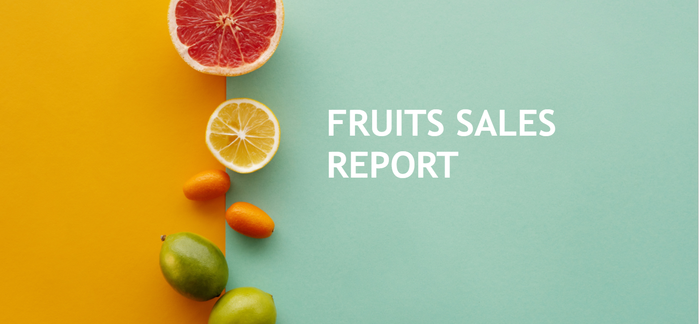
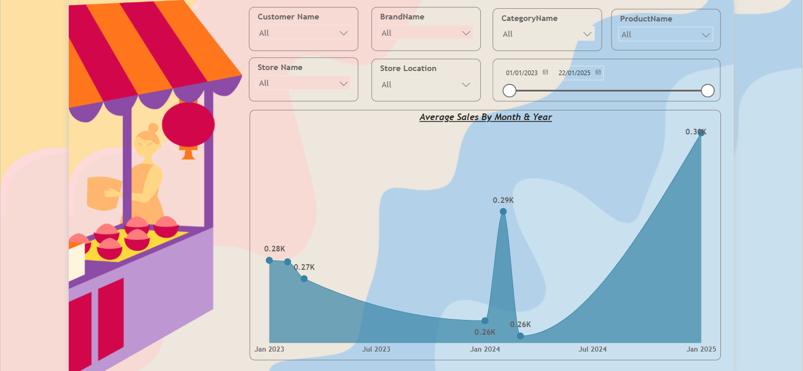

# 🍎 Fruits Sales Dashboard (Power BI)

This project is a **Fruits Sales Dashboard** built in **Power BI** as part of my data analytics learning journey.  
In this report, I focused on understanding **Average vs Total Sales**, using **YTD (Year-to-Date)** and **Running Total** to analyze performance over time, and applying **slicers** to make the dashboard interactive and closer to real business reporting.

## 📌 Project Overview
**Goal:** Convert raw fruits sales data into a clean, readable, and interactive dashboard to track trends and performance.  
**Key learning:** It’s not just about plotting numbers — it’s about choosing the right metric (average vs total) and analyzing time-based performance.

## 🧩 Dashboard Highlights (What’s Inside)

### 1) Average Sales Trend (Month & Year)
- Tracks **Average Sales by Month & Year** to understand sales patterns over time.

### 2) Time-Based Performance (Running Total + YTD)
- **Running Total by Date:** Shows cumulative sales growth over time.
- **Total YTD Sales:** Tracks year-to-date performance.

### 3) Customer & Store Performance
- **Average Sales by Customer:** Compare customer contribution using average sales.
- **Top 5 Stores by Sales:** Identify best-performing stores.

## 🎛️ Filters / Slicers Used
To make the report interactive, I added slicers for:
- Customer Name  
- Brand Name  
- Category Name  
- Product Name  
- Store Name  
- Store Location  
- Date Range  

## 🔧 Workflow (What I Did)
1. Loaded the dataset into **Power BI**
2. Cleaned and prepared the data (basic transformations + structuring)
3. Built time-based logic using **DAX**
   - Created **Running Total**
   - Created **YTD Sales**
4. Designed visuals to analyze:
   - Trends over time (Average Sales by Month/Year)
   - Cumulative growth (Running Total)
   - Current year progress (YTD)
   - Customer & store rankings
5. Added slicers to make the dashboard fully interactive

## 🧠 Skills Used
- Power BI (dashboard building + visual design)
- Basic DAX (YTD, Running Total, measures)
- Time intelligence concepts (YTD / cumulative tracking)
- Slicers & interactivity
- Data storytelling (clean, readable layout)
